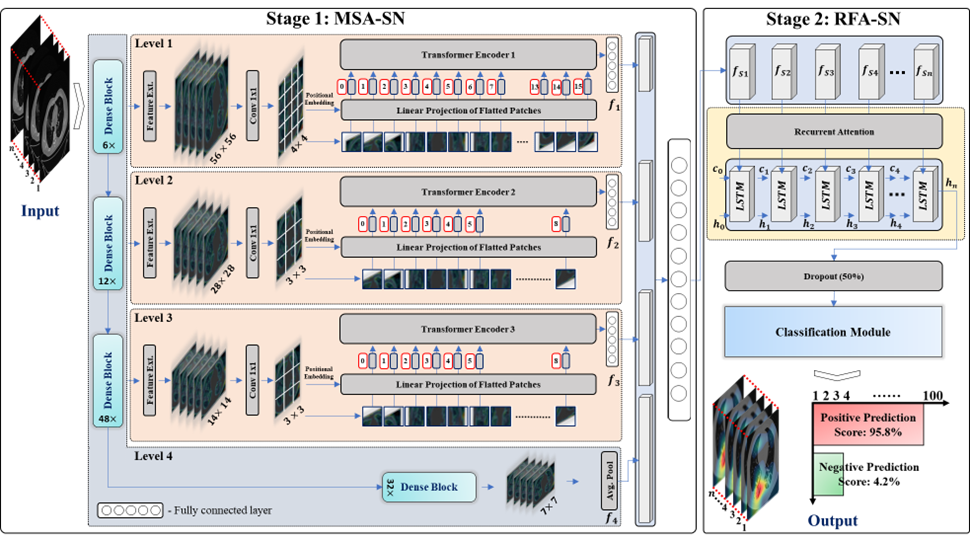

# Synergistic Fusion of a Multilevel Visual Transformer in CNN for Variable-Length Volumetric Radiographic Data Analysis in Biomedicine

**Authors**: Muhammad Owais, Muhammad Zubair, Taimur Hassan, Anabia Sohail, Divya Velayudhan, Naoufel Werghi, and Irfan Hussain

---

## Overview

  
*Figure 1: Overview of the Synergistic Fusion Framework*

This repository showcases the implementation of a novel deep learning framework designed for variable-length volumetric radiographic data analysis in biomedicine. Key innovations include:
- A multilevel spatio-recurrent attention network (MSR-AN).
- Efficient integration of a lightweight vision transformer with a convolutional neural network (CNN).
- Capability to analyze variable-length 3D inputs using single annotations.

[Read the Paper](https://github.com/Owais-CodeHub/MSR-AN) | [View the Code](https://github.com/Owais-CodeHub/MSR-AN)

---

## Dataset

  
*Figure 2: Samples from the Volumetric Radiographic Datasets*  

Explore the datasets used in our evaluation:
1. [Dataset A - Lung CT Scans](link-to-dataset)
2. [Dataset B - Public Radiographic Repository](link-to-dataset)
3. [Dataset C - Composite Repository](link-to-dataset)

---

## Results

  
*Figure 3: Performance Comparison of Proposed Model with Baselines*  

| Metric        | MSR-AN (Proposed) | Baseline Model | Improvement |
|---------------|--------------------|----------------|-------------|
| Accuracy (%)  | 98.54             | 93.46          | +5.08%      |
| F1 Score (%)  | 98.51             | 93.33          | +5.18%      |
| Avg. Precision (%) | 98.77         | 94.12          | +4.65%      |
| Avg. Recall (%)    | 98.25         | 92.59          | +5.66%      |

---

## Methodology

The proposed framework integrates:
1. **Multilevel Spatio-Attention Sub-Network (MSA-SN):**
   - Extracts spatial features using a synergistic fusion of a lightweight vision transformer and CNN.
   - Employs attention mechanisms for multilevel feature aggregation.

2. **Recurrent Feature Alignment Sub-Network (RFA-SN):**
   - Processes variable-length sequences using self-attention and LSTM.
   - Captures 3D structural dependencies for volumetric analysis.

3. **Two-Step Training Strategy:**
   - Sequentially trains MSA-SN and RFA-SN using cross-entropy loss.
   - Freezes intermediate layers to stabilize learning.

For details, refer to [Methodology Section](https://github.com/Owais-CodeHub/MSR-AN).

---

## Applications

- Computer-aided diagnosis for pulmonary diseases.
- Analysis of volumetric radiographic data (e.g., CT, MRI).
- Multimodal data integration for enhanced medical decision-making.

---

## Citation

If you use this code or dataset, please cite:

```bibtex
@article{owais2024synergistic,
  title={Synergistic Fusion of a Multilevel Visual Transformer in CNN for Variable-Length Volumetric Radiographic Data Analysis and Content-based Retrieval},
  journal={Preprint},
  year={2024},
}
```

---
